<div align="center">



<br/>


<br/>

<a href="https://www.linkedin.com/in/amitvashu/"></a>
<a href="mailto:yadavamit9948@gmail.com"></a>
<a href="https://amitvashu.github.io/"></a>


</div>

<br/>

## Hello

I'm Amit, an embedded software engineer in Bangalore with 7+ years in firmware integration,
system validation and test automation for automotive platforms.

What I like is the point where software meets the hardware it runs on — bringing up a build on a
real bench, watching a CAN or Ethernet trace, and chasing a bug with JTAG and Trace32 until the
ECU finally does what the spec says it should.

Right now that means the STLA SmartCockpit at Stellantis: one HPC running QNX, Yocto Linux and
Android Automotive OS side by side, with teams across NA, EMEA and APAC shipping into the same
release.

<br/>

## Where I've worked

<table>
<tr>
<td width="50%" valign="top">

### [Stellantis](https://www.stellantis.com/)
**Senior Engineer · Sep 2022 – Present**

Integration and validation of the STLA SmartCockpit — the infotainment and cockpit platform built
on the STLA Brain architecture.

</td>
<td width="50%" valign="top">

### [Bosch Global Software Technologies](https://www.bosch-softwaretechnologies.com/)
**Software Engineer · Aug 2019 – Sep 2022**

ECU testing on hardware-in-the-loop benches, from the bench setup itself to the automated test
suites running on it.

</td>
</tr>

<tr>
<td valign="top">

- HPC platform integration on Yocto and QNX
- Daily builds and delivery on Jenkins and TeamCity
- Python automation frameworks for Classic AUTOSAR
- Embedded test workflows wired into cloud CI
- Validation across HPC, Zonal and Classic AUTOSAR ECUs
- CAN, Ethernet, LIN and I2C interface testing
- Led automation across cross-functional validation teams

</td>
<td valign="top">

- Built the HIL setup from scratch
- Automated 98% of test scripts in Vector vTestStudio
- Test plans written against system requirements
- Spec analysis, test scripting and peer reviews
- Test cases and results tracked in IBM DOORS
- Verified application performance against spec

</td>
</tr>

<tr>
<td valign="bottom">

```
QNX  ·  Yocto Linux  ·  Android Automotive  ·  C++  ·  Python
```


</td>
<td valign="bottom">

```
HIL  ·  vTestStudio  ·  CAPL  ·  CANoe  ·  IBM DOORS
```


</td>
</tr>
</table>

<br/>

## Side projects

- [neural_nw_from_scratch](https://github.com/amitvashu/neural_nw_from_scratch) — the math and code behind a 2-layer neural network, in Python
- [local_nw](https://github.com/amitvashu/local_nw) — host a page on your local network for quick file sharing
- [browser_extension](https://github.com/amitvashu/browser_extension) — a cross-browser extension in JavaScript

<br/>

## Tools of the trade

<div align="center">

<table>
<tr><td align="right"><b>Languages</b></td><td>

</td></tr>
<tr><td align="right"><b>Platforms</b></td><td>

<br/><code>QNX (RTOS)</code> · <code>Yocto Linux</code> · <code>Android Automotive OS</code> · <code>Classic AUTOSAR</code>
</td></tr>
<tr><td align="right"><b>Interfaces</b></td><td>
<code>CAN</code> · <code>LIN</code> · <code>Ethernet</code> · <code>SPI</code> · <code>I2C</code> · <code>UART</code>
</td></tr>
<tr><td align="right"><b>Debug&nbsp;&amp;&nbsp;Validation</b></td><td>
<code>JTAG</code> · <code>Trace32</code> · <code>GDB</code> · <code>Log Analysis</code> · <code>HIL</code> · <code>System Validation</code>
</td></tr>
<tr><td align="right"><b>Test&nbsp;Automation</b></td><td>
<code>Robot Framework</code> · <code>CAPL</code> · <code>CANoe</code> · <code>vTestStudio</code> · <code>ECU.Test</code> · <code>dSPACE</code>
</td></tr>
<tr><td align="right"><b>Build&nbsp;&amp;&nbsp;CI</b></td><td>

<br/><code>Jenkins</code> · <code>TeamCity</code> · <code>Git</code> · <code>IBM DOORS</code>
</td></tr>
</table>

</div>

<br/>

## By the numbers

<div align="center">


<br/>


<br/>


</div>

<br/>

---

<div align="center">

### Get in touch

Always happy to talk about ECU bring-up, HIL benches, test automation, or anything where the bug
only shows up on real hardware.

<a href="mailto:yadavamit9948@gmail.com"><b>yadavamit9948@gmail.com</b></a>
&nbsp;·&nbsp;
<a href="https://www.linkedin.com/in/amitvashu/"><b>LinkedIn</b></a>
&nbsp;·&nbsp;
<a href="https://amitvashu.github.io/"><b>amitvashu.github.io</b></a>

<br/><br/>


</div>
